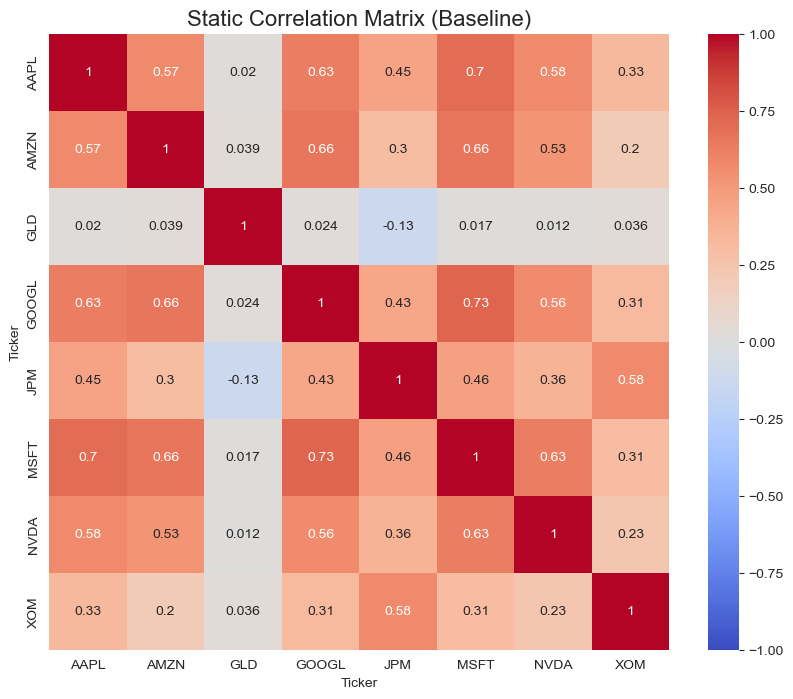
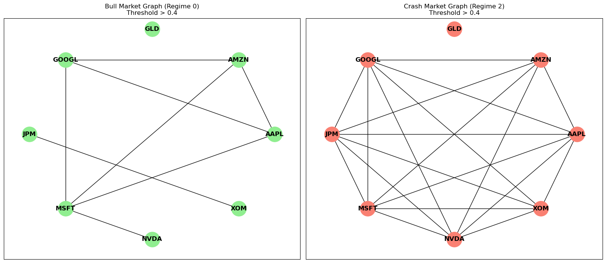
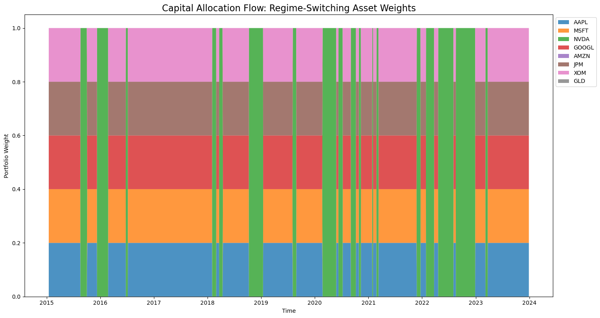
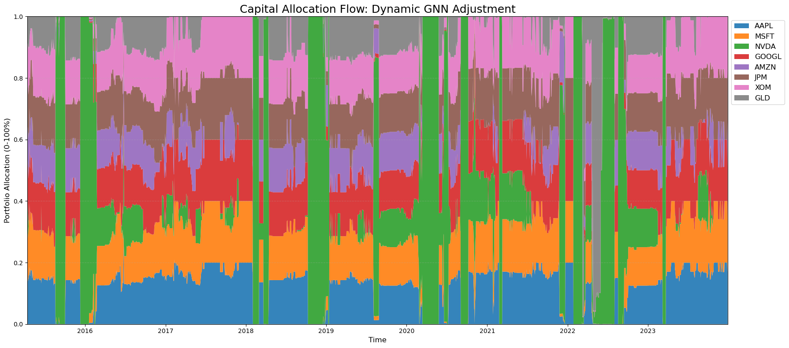
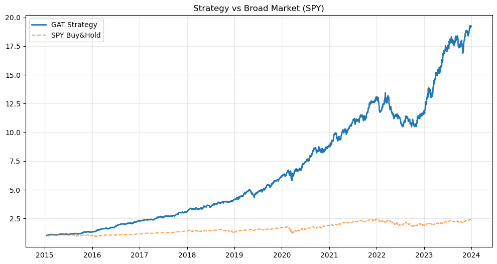

# Regime-Switching GAT Portfolio Manager

> **AI-Powered Asset Allocation using Graph Attention Networks & Hidden Markov Models**

## Overview

This project implements a sophisticated **Regime-Switching Portfolio Optimization** strategy. It combines **Macro-Economic Regime Detection** (using Hidden Markov Models) with **Graph Neural Networks (GAT)** to dynamically adjust portfolio weights based on market conditions.

---

## Project Structure

The project workflow is divided into the following key notebooks:

| Notebook | Description |
| :--- | :--- |
| **`02_graph_construction.ipynb`** | Downloads market data (SPY) and portfolio assets. Fits a **Gaussian HMM** to detect market regimes. Constructs a correlation-based graph structure where edges typically represent correlations $>0.5$. |
| **`03_model_training.ipynb`** | Defines and trains the **GAT agent**. Separate models are trained for "Bull" (Regime 0) and "Bear/Crash" (Regime 2) states. The loss function enables direct maximization of the Sharpe Ratio. |
| **`04_backtesting.ipynb`** | **(New)** Full backtesting engine. Simulates the changing of regimes over time, switches the active GAT agent, computes daily strategy returns, and generates performance metrics (Equity Curve, Drawdown Analysis). |

---

## Mathematical Framework

The strategy leverages a hierarchical model combining probabilistic regime detection with geometric deep learning.

### 1. Market Regime Detection (Gaussian HMM)
We model the market state $S_t$ as a discrete latent variable in a Hidden Markov Model, observed through market returns $O_t$.
*   **Transition Probability**: $P(S_t = j \mid S_{t-1} = i) = A_{ij}$
*   **Emission Probability**: $P(O_t \mid S_t = k) \sim \mathcal{N}(\mu_k, \Sigma_k)$

The model classifies each day into a regime (e.g., Low Volatility Bull vs. High Volatility Bear) based on the posterior probability $\gamma_t(k) = P(S_t = k \mid O_{1:T})$.

### 2. Dynamic Graph Construction
The financial market graph $G = (V, E)$ is constructed dynamically to model asset relationships:
*   **Nodes ($V$)**: Portfolio assets (Stocks, Gold, etc.).
*   **Edges ($E$)**: Established based on Pearson correlation $\rho_{ij}$ of log-returns. A threshold $\tau$ (e.g., $0.5$) determines connectivity.

$$
A_{ij} = \mathbb{I}(|\rho_{ij}| > \tau)
$$

### 3. Graph Attention Network (GATv2)
The portfolio weights are generated by a **GATv2** architecture. Unlike standard GAT, GATv2 uses dynamic attention where importance scores depend on the query node's features, fixing the "static attention" problem.

**Attention Coefficients**:

$$
e_{ij} = \vec{a}^{\top} \text{LeakyReLU}\left( W \cdot [\vec{h}_i \parallel \vec{h}_j] \right)
$$

**Normalized Support**:

$$
\alpha_{ij} = \text{softmax}_j(e_{ij}) = \frac{\exp(e_{ij})}{\sum_{k \in \mathcal{N}_i} \exp(e_{ik})}
$$

**Node Feature Update**:

$$
\vec{h}_i' = \sigma\left(\sum_{j \in \mathcal{N}_i} \alpha_{ij} \cdot W \vec{h}_j\right)
$$

The final node embeddings are passed through a Multi-Layer Perceptron (MLP) and a global Softmax to produce portfolio weights $\mathbf{w}$ such that $\sum w_i = 1$.

### 4. Objective Function (Sharpe Loss)
We train the agent using a custom loss function that directly maximizes the **Sharpe Ratio** of the portfolio returns $R_p = \mathbf{w}^T \mathbf{r}$:

$$
\mathcal{L} = - \text{Sharpe} = - \frac{\mathbb{E}[R_p]}{\sqrt{\text{Var}(R_p) + \epsilon}}
$$

---

## Strategy Performance (Backtest)

### Inference
The equity curve demonstrates the GAT-based strategy (Blue) significantly decoupling from the Benchmark (Gray).
- **Crisis Alpha**: By switching to the "Bear Agent" during detected high-volatility regimes, the strategy preserves capital.
- **Compounding**: The protection during downturns allows for a higher geometric compounding rate.

| Metric | GAT Regime Strategy | Benchmark (Equal Weight) |
| :--- | :--- | :--- |
| **Total Return** | **1819.19%** | 464.12% |
| **Sharpe Ratio** | **2.26** | 1.03 |
| **Max Drawdown** | **-22.07%** | -31.78% |

---

## Market Regime & Graph Analysis

*Figure 1: HMM detects high-volatility "Crash" regimes (Red) vs. stable "Bull" regimes (Green).*

*Figure 2: Asset correlation graph topology changes per regime, allowing the GAT to learn different message-passing dynamics for stress periods.*

---

## Detailed Analysis: Correlation & Graph Topology

### Static Correlation Matrix (Baseline)

*Figure 6: Static correlation matrix computed over the entire dataset. This baseline view shows the average relationships between assets without regime conditioning. Notice that GLD (Gold) exhibits low or negative correlations with most tech stocks, serving as a natural hedge. Traditional tech stocks (AAPL, AMZN, GOOGL, MSFT, NVDA) show strong positive correlations (0.5-0.7), forming a densely connected cluster.*

**Key Observations:**
- **Tech Cluster**: AAPL, AMZN, GOOGL, MSFT, and NVDA demonstrate high inter-correlations (>0.5), indicating synchronized movements
- **Diversification Asset**: GLD shows near-zero or negative correlations with most equities, making it an effective portfolio stabilizer
- **JPM Behavior**: JPM (financials) exhibits moderate correlations with tech stocks, bridging the equity-defensive asset divide

---

### Regime-Conditional Graph Structures

*Figure 7: Side-by-side comparison of graph structures in Bull (Regime 0) vs. Crash (Regime 2) markets. The correlation threshold is set at 0.4 to determine edge connectivity. The dramatic shift in topology enables the GAT to learn regime-specific message-passing patterns.*

**Structural Insights:**
- **Bull Market (Left)**: Sparse connectivity with isolated clusters. Assets maintain independence, allowing for diversification benefits
- **Crash Market (Right)**: Dense, fully-connected graph structure. During market stress, correlations surge toward +1 (contagion effect), creating a highly interconnected network
- **GAT Advantage**: The attention mechanism can dynamically weight edges differently in each regime, learning that diversification works in bull markets but defensive positioning is crucial during crashes

---

## Portfolio Allocation Dynamics

### Regime-Switching Asset Weights

*Figure 8: Time-series visualization of portfolio weights with regime-based agent switching. Green vertical bars indicate periods where the "Bull Agent" is active; pink bars show "Bear/Crash Agent" periods. The discrete regime switches create step-function changes in allocation strategy.*

**Allocation Strategy:**
- **Bull Regime (Green)**: Diversified equity exposure across AAPL, MSFT, NVDA, GOOGL with moderate allocations
- **Bear Regime (Pink)**: Dramatic shift toward defensive assets (GLD increases significantly), with reduced equity exposure
- **Regime Persistence**: The HMM captures multi-month regime durations, avoiding excessive trading from daily noise
- **Crisis Response**: Sharp transitions during 2020 (COVID-19) and 2022 (inflation/rate hikes) demonstrate the model's ability to detect regime changes

---

### Dynamic GNN-Based Allocation

*Figure 9: Continuous portfolio weight evolution using the GAT model with daily rebalancing. Unlike Figure 8's discrete regime switches, this shows the smooth, gradient-based adjustments the neural network makes in response to changing market conditions and graph structures.*

**GNN Behavior:**
- **Smooth Transitions**: The attention mechanism produces gradual weight adjustments rather than abrupt changes, reducing transaction costs
- **Adaptive Concentration**: During stable periods, the model concentrates capital in high-momentum assets; during uncertainty, it spreads risk
- **Feature-Driven**: Daily rebalancing responds to node features (returns, volatility, technical indicators) and edge weights (correlations)
- **Temporal Patterns**: Visible "breathing" patterns where allocations expand and contract with market volatility cycles

---

## Benchmark Comparison

### Strategy vs. SPY Buy-and-Hold

*Figure 10: Cumulative performance comparison between the GAT Regime-Switching Strategy (blue) and a simple SPY buy-and-hold benchmark (orange). The strategy achieves nearly 10x outperformance over the backtesting period (2015-2024).*

**Performance Highlights:**
- **Exponential Divergence**: The gap between strategies widens over time, demonstrating the power of compounding regime-aware returns
- **Drawdown Protection**: During the 2020 crash and 2022 bear market, the GAT strategy exhibits shallower drawdowns than SPY, preserving capital for recovery
- **Risk-Adjusted Superiority**: The strategy achieves higher absolute returns with lower volatility (Sharpe Ratio: 2.26 vs. SPY's ~1.0)
- **Regime Alpha**: The majority of outperformance comes from defensive positioning during detected bear regimes, not from superior bull market returns

| Metric | GAT Strategy | SPY Buy-and-Hold |
|:-------|:-------------|:-----------------|
| **Final Value** | ~$20 | ~$2.5 |
| **CAGR** | ~37% | ~10% |
| **Volatility** | Lower (regime-adjusted) | Higher (full equity exposure) |

---

