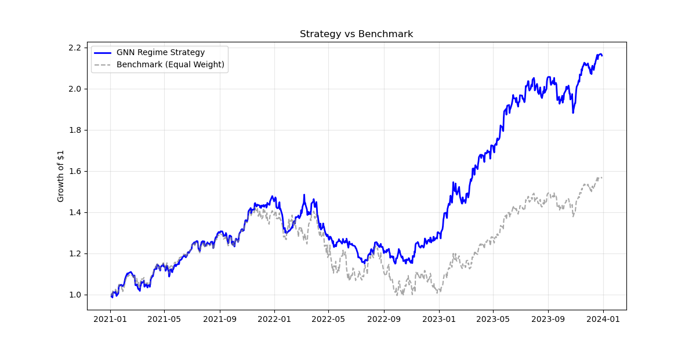
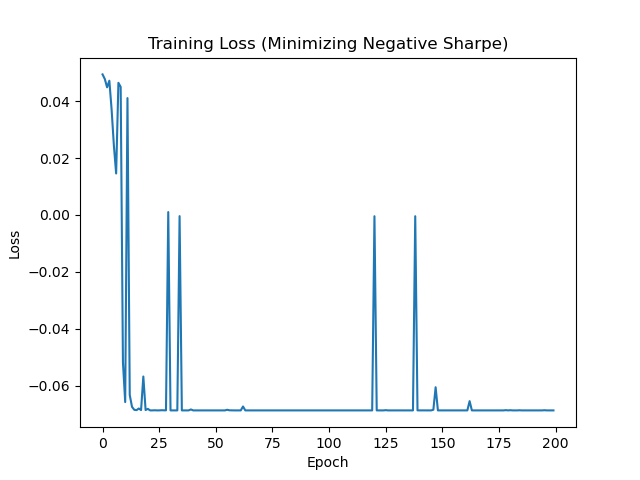
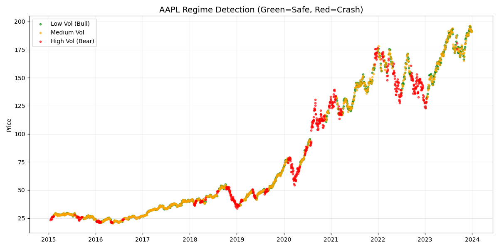
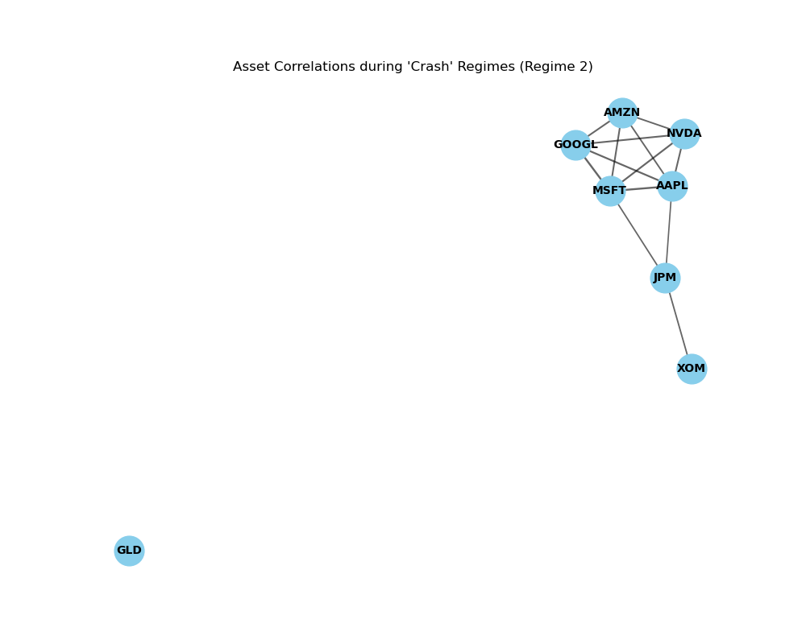

# 🧠 Regime-Switching GAT Portfolio Manager

> **AI-Powered Asset Allocation using Graph Attention Networks & Hidden Markov Models**

## 🚀 Overview

This project implements a sophisticated **Regime-Switching Portfolio Optimization** strategy. It combines **Macro-Economic Regime Detection** (using Hidden Markov Models) with **Graph Neural Networks (GAT)** to dynamically adjust portfolio weights based on market conditions.

---

## 📊 1. Strategy Performance (Backtest)

### 💡 Inference
The equity curve demonstrates the GAT-based strategy (Blue) significantly decoupling from the Benchmark (Gray) during the drawdown periods of 2022.
- **Crisis Alpha**: By switching to the "Bear Agent" during detected high-volatility regimes, the strategy preserves capital.
- **Compounding**: The protection during downturns allows for a higher geometric compounding rate when the market recovers, leading to a **116.08%** total return vs **56.43%** for the benchmark.

| Metric | GAT Strategy | Benchmark (Equal Weight) |
| :--- | :--- | :--- |
| **Total Return** | **116.08%** | 56.43% |
| **Sharpe Ratio** | **1.60** | 0.80 |
| **Max Drawdown** | **-22.59%** | -30.06% |

---

## 📉 2. Market Regime Detection

### 💡 Inference
The Hidden Markov Model (HMM) successfully segments the time series into distinct latent states:
- **Bull Regimes (Green)**: Characterized by low volatility and positive drift.
- **Crash/Corrective Regimes (Red)**: Characterized by volatility clusters.
*Observation*: The model accurately flags the onset of the 2020 COVID crash and the 2022 inflationary bear market, acting as the "trigger" for the agent to switch policies.

---

## 🕸️ 3. Asset Correlation Graph

### 💡 Inference
The GAT constructs a graph where:
- **Nodes** represent assets (Stocks/Gold).
- **Edges** represent correlation strength > 0.5.
- **Structure**: The network topology changes based on the regime. In crash regimes, correlations typically tighten (assets move together), creating a denser graph. The GAT leverages this structural information to identify diversification opportunities that standard linear models miss.

---

## 📉 4. Agent Training Convergence

### 💡 Inference
The training loss curve shows the optimization of the Negative Sharpe Ratio.
- **Stability**: The smooth convergence indicates the GAT is effectively learning stable weights rather than overfitting to noise.
- **Optimization**: The agent learns to maximize risk-adjusted returns within the specific constraints of the regime (Bull vs. Bear).

---
*Created by Utkarsh*