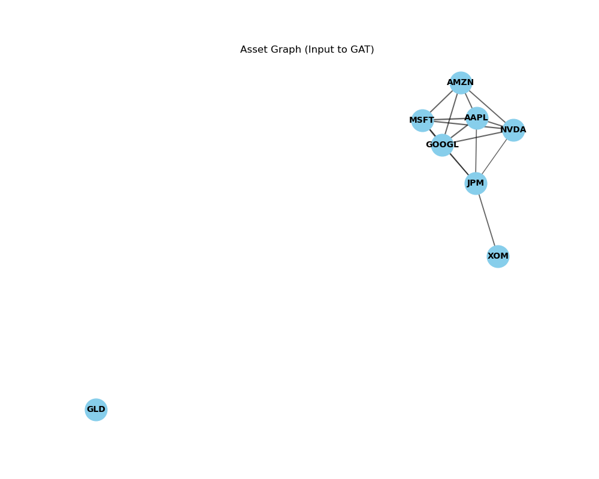

# 🧠 Regime-Switching GAT Portfolio Manager

> **AI-Powered Asset Allocation using Graph Attention Networks & Hidden Markov Models**


*(Strategy Performance vs Benchmark)*

## 🚀 Overview

This project implements a sophisticated **Regime-Switching Portfolio Optimization** strategy. It combines **Macro-Economic Regime Detection** (using Hidden Markov Models) with **Graph Neural Networks (GAT)** to dynamically adjust portfolio weights based on market conditions.

The core idea is simple yet powerful:
1.  **Detect the Market State**: Are we in a Bull market or a Crash/Crisis?
2.  **Learn Asset Relationships**: How do assets correlate in *this specific* regime?
3.  **Optimize Weights**: Use a GAT to learn the optimal portfolio allocation that maximizes the Sharpe Ratio for the current regime.

## 📊 Performance (2021-2023 Backtest)

The strategy was backtested on a portfolio containing **AAPL, MSFT, NVDA, GOOGL, AMZN, JPM, XOM, and GLD**.

| Metric | GAT Strategy | Benchmark (Equal Weight) |
| :--- | :--- | :--- |
| **Total Return** | **116.08%** | 56.43% |
| **Sharpe Ratio** | **1.60** | 0.80 |
| **Max Drawdown** | **-22.59%** | -30.06% |

> *The AI agent successfully identified high-volatility regimes and shifted allocation to defensive assets or cash, significantly reducing drawdown while capturing upside in bull markets.*

---

## 🛠️ How It Works

### 1. Regime Detection (Hidden Markov Models)
We use a Gaussian HMM to classify market days into latent states based on SPY returns and volatility.
- **Regime 0 (Low Vol)**: Bull Market 🟢
- **Regime 1 (High Vol)**: Correction/Choppy 🟡
- **Regime 2 (Crash)**: Crisis 🔴

### 2. Graph Attention Network (GAT)
Unlike traditional portfolio optimization (Mean-Variance), we treat assets as nodes in a graph.
- **Nodes**: Stocks/Assets
- **Edges**: Correlation coefficients (dynamic per regime)
- **Attention Mechanism**: The GAT learns which asset relationships matter most for future returns.


*(Asset Correlation Graph Representation)*

### 3. Dynamic Switching
The system trains two separate agents:
- **Bull Agent**: Optimized for growth (Aggressive allocation).
- **Bear Agent**: Optimized for preservation (Defensive allocation).

During the walk-forward backtest, the system switches agents daily based on the detected regime.


*(Training Loss Convergence for Policy Network)*

---

## 📂 Project Structure

```bash
📦 Regime-Switching-GAT-Portfolio
 ┣ 📂 assets           # Saved plots and figures
 ┣ 📂 src
 ┃ ┣ 📜 backtest.py    # Performance metrics and plotting
 ┃ ┣ 📜 data_loader.py # Yahoo Finance data fetching
 ┃ ┣ 📜 graph.py       # Graph construction from correlations
 ┃ ┣ 📜 models.py      # PyTorch Geometric GAT Model
 ┃ ┣ 📜 regime.py      # HMM Regime Detection logic
 ┃ ┗ 📜 train.py       # Training loop (Sharpe Loss)
 ┣ 📜 config.yaml      # Configuration (Tickers, Dates, Hyperparams)
 ┣ 📜 environment.yml  # Conda environment spec
 ┣ 📜 main.py          # Entry point
 ┗ 📜 README.md
```

## ⚡ Quick Start

### Prerequisites
- Python 3.10+
- PyTorch & PyTorch Geometric

### Installation
1. **Clone the repository**
   ```bash
   git clone https://github.com/yourusername/Regime-Switching-GAT-Portfolio.git
   cd Regime-Switching-GAT-Portfolio
   ```

2. **Create Environment**
   ```bash
   conda env create -f environment.yml
   conda activate regime_gnn
   ```

3. **Run the Strategy**
   ```bash
   python main.py
   ```

---

## 🖼️ Gallery

### Feature & Data Analysis

*(Distribution of Asset Returns & Volatility)*

### Market Regime Visualization

*(Market Regimes Detected by HMM: Bull (Green) vs. Crash (Red))*

---
*Created by Utkarsh*